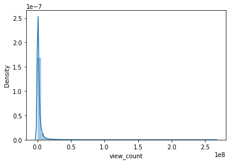
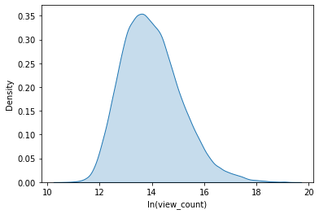
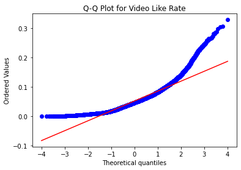
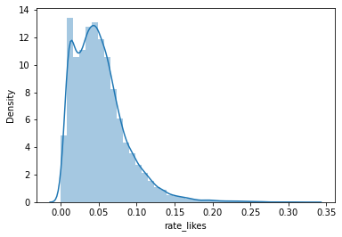
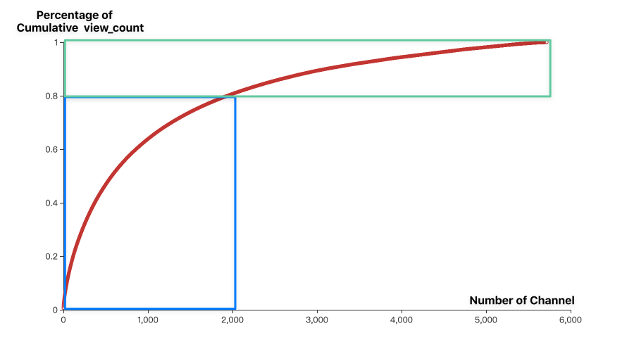

 Catalog 

[TOC]

<!-- 注释语句：导出PDF时会在这里分页 -->

# Data Analysis about Youtube Trending based on Python Pandas

Jiaming HAN

<i>The Hong Kong Polytechnic University</i>

<b>Abstract: </b> 
 

Social platforms like Youtube generate a large amount of data. This project takes factors such as the number of video plays and video likes from Youtube Trending and runs a regression predictive analysis and explores what is influencing these factors; using the best models to explore the patterns. 

<b>Key Words: </b>
 

Data Science; Exploratory Data Analysis; Youtube; Statistics; 

## Introduction

Youtube is one of the most popular video sharing platforms, with a huge variety of videos in different categories. It serves people of all ages in most countries around the world. Watching YouTube videos has become a way of life for many people, especially young people. Youtube also promotes corporate marketing, education, and public service campaigns. This project collects data about Youtube Trending Video over the past two years, analyzes the factors such as video view count, video likes, etc., and explore potential patterns and appropriate models uwith Pandas. It will help video creators to create more impactful videos, and also help companies and video bloggers to market and increase revenue.

## Purpose

Youtube bloggers earn money by creating great videos. Usually, the more popular the video is, the higher the income the author receives. Some of the many organizations also use Youtube videos to advertise their corporate culture and promote their products. Businesses and bloggers apply reviewd models and data generated by project in their subsequent creations will get higher video plays and likes, keeping continued revenue growth.

## Methodology

The Project implementation follows the **Exploratory Data Analysis (EDA)**. EDA is a data analysis method or philosophy which involves a number of techniques [1]. Figure 3-1 illustrates a standard process. Research utilizes data mining, data cleaning, regression, data visualization.

 Figure 3-1: EDA Techniques 

**Anaconda** is the Python release used in this project. It provides a lot of packages for data science. Pandas, as the main analysis tool, is included. **Jupyter** is a powerful data analysis notebook. It captures the complete flows of the implementation.

## Implementation

### Data Description

The data researched is Youtube Trending data, which includes videos that Youtube Inc. considers to be potentially trending, on a country-by-country basis, usually updated daily [2]. It was obtained for the United States from August 11, 2020 to May 23, 2022, approximately 130K rows [3].

After removing the unrelated columns, the following fields are available. It was shown in Figure 4-1.

|            |             | Column Title  |           |               |
| ---------- | ----------- | ------------- | --------- | ------------- |
| video_id   | publishedAt | channelTitle  | channelId | comment_count |
| tags       | title       | trending_date | likes     | dislikes      |
| view_count | categoryId  |               |           |               |

 Figure 4-1: Related column headings

### Data Cleaning

The data are relatively complete. However, youtube does not show the number of plays, likes, dislikes or comments on certain videos for some purposes. Also, youtube no longer shows the number of dislikes publicly since last December. Therefore the research does not focus heavily on dislikes.

Most of these rows will be eliminated if the number of plays, likes or comments is 0. As for dislikes, considering the large amount of missing data, the study will deal with it on a case by case basis. 

Since the same video may appear in Trending for consecutive days, it is appropriate to keep the data of the last occurrence in some cases, which records the maximum factor value. 

### Analysis factors

Figure 4-2 shows the description of the factor values. It contains non-null values, mean, standard deviation, maximum value, minimum value, and quantile. Most of the popular videos have more than 60k views and 1.5k comments. The average number of likes is about 52k. Apparently, the values of these key factors varied widely.   It is feasible to study the characteristics of the variation of these values. 

|  |   view_count |        likes | comment_count |
| ----: | -----------: | -----------: | ------------- |
| count | 2.325800e+04 | 2.325800e+04 | 2.325800e+04  |
|  mean | 2.821533e+06 | 1.434977e+05 | 1.124083e+04  |
|   std | 6.934122e+06 | 4.003858e+05 | 8.638233e+04  |
|   min | 4.347200e+04 | 1.700000e+01 | 4.000000e+00  |
|   25% | 5.898188e+05 | 2.148550e+04 | 1.513250e+03  |
|   50% | 1.202252e+06 | 5.157550e+04 | 3.352000e+03  |
|   75% | 2.610916e+06 | 1.295885e+05 | 7.777500e+03  |
|   max | 2.644074e+08 | 1.602153e+07 | 6.738537e+06  |

 Figure 4-2: Characteristics of factor values 

#### View Count Density

The vast majority of videos in the trending list have less than 10 million views. They revolve around the 14th power of e ≈ 1.2 million. However, there are still very few videos with more than 100 million. These can be roughly observed from Figure 4-3. 

 Figure 4-3: Denisty of view count

View Count does not appear to follow a normal distribution.

#### Likes Rate Features

The number of video likes may not reflect how much users like the video, considering the large difference in view count. Likes rate is defined as the ratio of the number of likes to the number of plays for a single video. It is typically an indication of whether a video is widely liked or not.

Quantile-Quantile plot (Q-Q Plot) could be used to verify whether the sample has a linear relationship with some distribution [4]. In the left plot of Figure 3-4, the blue line is the sample distribution, close to the red quantile of the normal distribution. Also, Kolmogorov - Smirnov [5] test significant is lower than 5%. Both are indicate that the video favorites of the Trending list show a normal distribution.

    

 Figure 4-4: Likes Rate Distribution 

In addition, according to the right graph of Figure 4-4, it can be concluded that the video likes rate is concentrated between 0% and 10%. Videos with more than 10% likes rate may be identified as widely liked videos.

#### Exploring correlations

Figures 4-5 show the correlation between the different attributes. The higher the absolute value, the greater the data correlation. Positive values indicate positive correlation. This is essential for the machine learning that will be implemented later.

The correlation between view count and the number of likes is 0.86, which is the highest. View count also correlates well with dislikes and comment count. These will be of interest to the research. Figures 4-6 corroborate in more detail the correlation characteristics of the view count and likes of the videos in the Trending list.

#### Exploring Channels

Figure 4-7 displays the percentage of count videos of the of top 15 channels. Videos from the NFL, NBA, and SSSniperWolf channels have appeared on the Youtube Trending List several times. Their content will have more opportunities to be exposed.

Figure 4-7: TOP15 Video Count Percentage Group by Channel 

Research also investigated the creative characteristics of these channels. Most of these channels are created on the themes of sports, entertainment, and games. Creators could improve videos' probability of becoming trending by creating contents with relevant themes.

Figure 4-8: Trends in the Percentage of Cumulative View Count by Channel 

The "leader" creators are exponentially more sought-after. Percentage of Cumulative View Count seems to follow the Pareto distribution, as presented in Figure 4-8. A small number of creators attract the majority of views in the Trending list. Companies may give preference to "5 leader creators" over "100 general creators" when selecting partners to advertise, subject to the availability of funds.

 Figure 4-9: TOP15 View Count Percentage Group by Channel 

The NBA and NPL videos make up about a quarter of the Trending list, but MrBeast's videos get more than three times as much view count as theirs. MrBeans' videos make up only 6% of the Trending list. It suggests that there is no apparent relationship between the channel view count and the number of videos. Figure 4-9 provides detail.

Companies may try to cooperate with channels has more view count and Trending video count to achieve more brand marketing.

#### Exploring Categories

The American people enjoy watching music, entertainment and gaming videos. These account for nearly 70% of Trending List's total view count in Figure 4-10. Compared to Figure 4-7, it is clear that although a number of videos from sports channels such as the NFL, NBA, are featured in Youtube Trending, music and entertainment videos receive much more views than sports videos. There is concern that science and education videos are less focused on. 

 Figure 4-10: TOP10 View Count Percentage Group by Category

Figure 4-11 highlights the three most popular categories in red. Although the days it takes for a video from being published to becoming Trending is not significantly affected by its category, days cost does not correlate positively with the popularity of the category. They were in the range of 28 to 38 hours. 

 Figure 4-11: TOP10 View Count Percentage Group by Category

####  Observation through period

Figure 4-12 illustrates the variation of video count and average value of view count per video, comment count per video, likes count per video with period. The trend is most likely influenced by Youtube or government policies.

The reason for measuring the average per video instead of directly summing the factor values over the period is to consider that the number of trending videos varies from period to period. The former is a better reflection of the pattern. 

 Figure 4-12: Trend of Factors over Period 

For about the past two years,

- The video count and average video view count has fluctuated in a fixed range. 
- The average video comment count dropped significantly recently.
- Average likes count per video slowly drops.

These metrics can be applied to characterize YouTube Trending in general. For example, all four factors in Figure 4-12 increase relatively around June. These may be influenced by real-time events such as Covid-19 upgrades, political issues, holidays, etc. 

## Further work

With the exploration above, it is beneficial for different experts to discover model best practices. Data scientists could precisely deploy machine learning models according to the organization's specific situation. Enterprise administrators may keep periodic research to continuously capture video market heat. 

## Summary

The project has analyzed the correlation of relevant factors in Youtube Trenging. It suggests that there is a large gap between different videos in view count and like count fields. The results of the correlation analysis indicated that View count correlates with like, dislike and comment count. The research also trends different categories, channels, and time periods to measure from multiple perspectives. Video creators and companies may review the program's data and analytics to improve their performance.

<!-- 注释语句：导出PDF时会在这里分页 -->

 Reference 

[1] "What is EDA?",  https://www.itl.nist.gov/div898/handbook/eda/section1/eda11.htm

[2] "What determines if a video is ranked on Trending?", https://support.google.com/youtube/answer/7239739?hl=en

[3] Data source from Kaggle, https://www.kaggle.com/datasets/rsrishav/youtube-trending-video-dataset. This includes 	 data from the US, UK, France, Canada, etc. However data for Hong Kong is missing. 

[4] "Understanding Q-Q Plots", https://data.library.virginia.edu/understanding-q-q-plots/

[5] Kstest, http://www.ece.northwestern.edu/local-apps/matlabhelp/toolbox/stats/kstest.html

<!-- 注释语句：导出PDF时会在这里分页 -->

## Appendix

The source code and implementation of the project are all included in

1. Data sources for analysis: US_youtube_trending_data.csv
2. Category Tags: US_category_id. csv
3. Jupyter Notebook (Source code): lab.ipynb
4. Electronic material:
   1. Report.pdf
   2. Implementation: lab.ipynb.pdf

The content above is included in  https://connectpolyu-my.sharepoint.com/:f:/g/personal/20075519d_connect_polyu_hk/EtOfYfnTeqNAty_EhM09zAEBPJfsRlXfcjEkvu82ICOBaQ?e=8oOGXP
